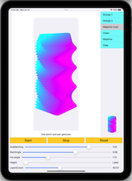

---------------------------
Rotation animation
==================

Project for experiments with layers transforms and animations, with perpose to make some loading indocator later. 

Animating component itself is in SDIndicator folder and can be configured with SDIndicatorConfig.

Example configs are in Configs.swift file

 

--- | --- | --- | ---
 |  |  | 

 
